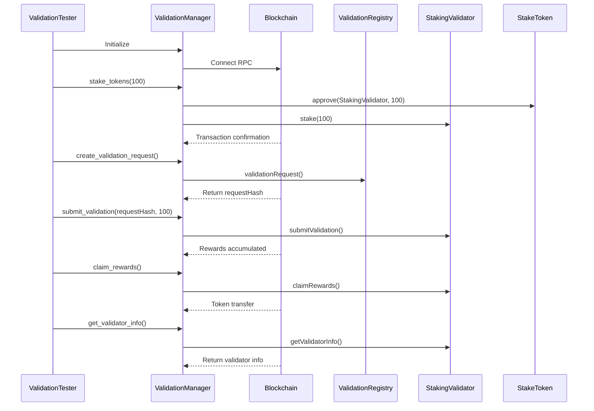

# Project Architecture

## 📁 Project Structure

```
aliasai-validator/
├── src/                          # Core source code
│   ├── __init__.py              # Package initialization
│   ├── main.py                  # Main test script
│   └── validation_manager.py   # ValidationManager core class
├── examples/                     # Usage examples
│   ├── simple_usage.py          # Simple usage example
│   └── custom_validation.py     # Custom validation workflow
├── scripts/                      # Convenience scripts
│   ├── run_test.sh              # Quick run test
│   └── check_env.sh             # Environment configuration check
├── docs/                         # Documentation
│   ├── QUICKSTART.md            # Quick start guide
│   └── ARCHITECTURE.md          # This file
├── pyproject.toml               # Project configuration and dependencies
├── .env.example                 # Environment variable template
├── .gitignore                   # Git ignore rules
├── LICENSE                      # MIT License
└── README.md                    # Main project documentation
```

## 🏗️ Core Architecture

### 1. ValidationManager Class

Located in `src/validation_manager.py`, this is the project's core.

**Responsibilities:**
- Interact with Ethereum blockchain
- Manage contract calls (ValidationRegistry, StakingValidator, StakeToken)
- Handle transaction signing and sending
- Query on-chain state

**Main Methods:**

```python
class ValidationManager:
    # Initialization
    __init__(rpc_url, validation_registry, staking_validator, stake_token, private_key, chain_id)

    # Staking operations
    stake_tokens(amount, wait_for_receipt, timeout) -> str

    # Create validation request
    create_validation_request(agent_id, request_uri, request_data, validator_address, ...) -> Tuple[bytes, str]

    # Submit validation result
    submit_validation(request_hash, response, response_uri, response_data, tag, ...) -> str

    # Claim rewards
    claim_rewards(wait_for_receipt, timeout) -> str

    # Query methods
    get_validator_info(validator_address) -> Dict
    get_validation_status(request_hash) -> Dict
    get_staking_stats() -> Dict
```

### 2. ValidationTester Class

Located in `src/main.py`, implements the complete six-stage testing workflow.

**Test Stages:**

```python
class ValidationTester:
    stage1_environment_check()    # Environment check
    stage2_stake()                # Stake tokens
    stage3_create_request()       # Create validation request
    stage4_submit_validation()    # Submit validation result
    stage5_claim_rewards()        # Claim rewards
    stage6_statistics()           # Statistics verification
```

**Output:**
- Real-time console output (colored formatting)
- JSON test report (`validation_test_report.json`)
- Etherscan transaction links

## 🔄 Interaction Flow

### Complete Validation Workflow



## 📦 Dependencies

### Core Dependencies

```toml
[dependencies]
web3 = ">=6.15.0"          # Ethereum interaction
eth-account = ">=0.10.0"   # Account and signing
python-dotenv = ">=1.0.0"  # Environment variable loading
```

### Contract ABIs

Embedded in `validation_manager.py`:
- `VALIDATION_REGISTRY_ABI` - ValidationRegistry contract interface
- `STAKING_VALIDATOR_ABI` - StakingValidator contract interface
- `ERC20_ABI` - StakeToken (ERC-20) interface

## 🔐 Security Design

### Private Key Management

```python
# ✅ Recommended: Use environment variables
private_key = os.getenv("ERC8004_ADMIN_PRIVATE_KEY")

# ❌ Forbidden: Hardcode private keys
private_key = "abc123..."  # Never do this!
```

### Transaction Signing Process

```python
# 1. Build transaction
txn = contract.functions.method().build_transaction({...})

# 2. Sign locally
signed_txn = w3.eth.account.sign_transaction(txn, private_key)

# 3. Send raw transaction
tx_hash = w3.eth.send_raw_transaction(signed_txn.raw_transaction)
```

### Gas Management

```python
# EIP-1559 transactions
'maxFeePerGas': w3.to_wei(50, 'gwei'),         # Maximum fee
'maxPriorityFeePerGas': w3.to_wei(2, 'gwei'), # Priority fee
'gas': 500000                                   # Gas limit
```

## 🧪 Testing Architecture

### Test Modes

1. **Complete Test** (`src/main.py`)
   - Six-stage automated workflow
   - Generates detailed test reports
   - Suitable for CI/CD integration

2. **Simple Query** (`examples/simple_usage.py`)
   - Read-only operations, no transactions
   - Quick configuration verification
   - View current state

3. **Custom Validation** (`examples/custom_validation.py`)
   - Flexible parameter configuration
   - Can be integrated into other projects
   - Suitable for production use

### Error Handling

```python
try:
    # Execute operation
    tx_hash = manager.stake_tokens(amount)
except ConnectionError as e:
    # RPC connection failed
    print(f"RPC connection error: {e}")
except ValueError as e:
    # Parameter validation failed
    print(f"Parameter error: {e}")
except Exception as e:
    # Other errors
    print(f"Unknown error: {e}")
    traceback.print_exc()
```

## 🚀 Extensibility

### Adding New Features

1. **New Contract Methods**
   ```python
   # Add new method in ValidationManager
   def new_contract_method(self, param1, param2):
       txn = self.contract.functions.newMethod(param1, param2).build_transaction({...})
       # ... sign and send
   ```

2. **New Test Stages**
   ```python
   # Add new stage in ValidationTester
   def stage7_new_feature(self, manager):
       self.print_stage(7, "New Feature Test")
       # ... test logic
   ```

3. **Custom Report Formats**
   ```python
   # Modify save_report() method
   def save_report(self):
       # Save as CSV, HTML, etc.
   ```

## 📊 Performance Optimization

### Gas Optimization

- Batch operations to reduce transaction count
- Set reasonable Gas Limits
- Use EIP-1559 dynamic gas fees

### RPC Optimization

```python
# Use local node or paid RPC
rpc_url = "http://localhost:8545"  # Local node (fastest)
# rpc_url = "https://eth-sepolia.g.alchemy.com/v2/YOUR_KEY"  # Alchemy (stable)
```

### Concurrent Processing

```python
# For bulk queries, use concurrency
import asyncio
from web3 import AsyncWeb3

# Async query multiple validator info
async def batch_query_validators(addresses):
    tasks = [manager.get_validator_info(addr) for addr in addresses]
    return await asyncio.gather(*tasks)
```

## 🔍 Debugging Tips

### Enable Verbose Logging

```python
import logging

logging.basicConfig(level=logging.DEBUG)
```

### View Transaction Details

```python
receipt = w3.eth.get_transaction_receipt(tx_hash)
print(json.dumps(dict(receipt), indent=2, default=str))
```

### Simulate Transactions (No Send)

```python
# Use call() to simulate transaction without consuming gas
result = contract.functions.method(params).call()
```

## 📚 Reference Resources

- [Web3.py Official Documentation](https://web3py.readthedocs.io/)
- [ERC-8004 Standard](https://eips.ethereum.org/EIPS/eip-8004)
- [Ethereum JSON-RPC API](https://ethereum.org/en/developers/docs/apis/json-rpc/)
- [Etherscan API](https://docs.etherscan.io/)
